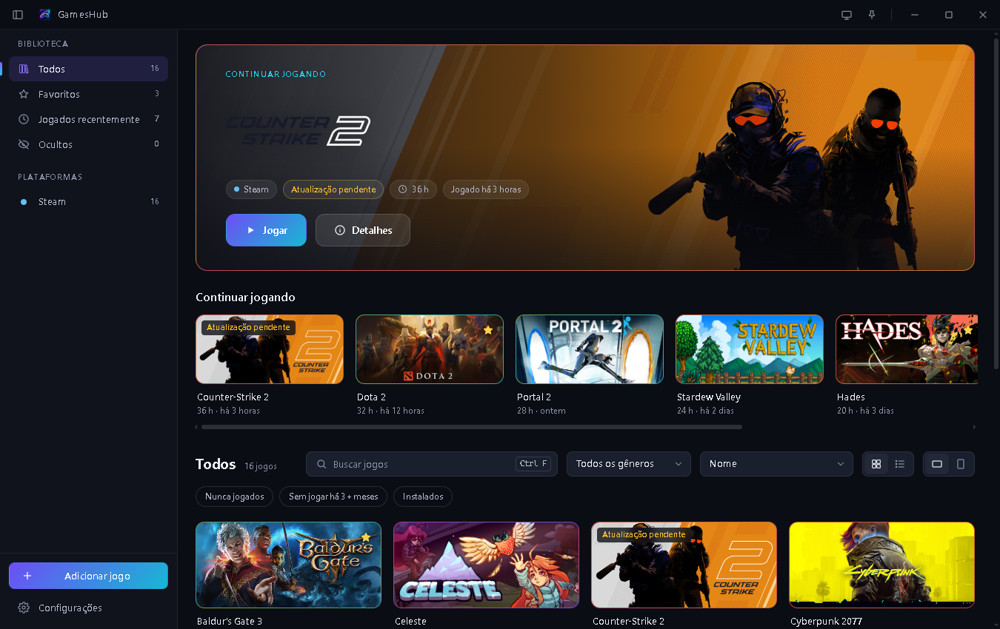
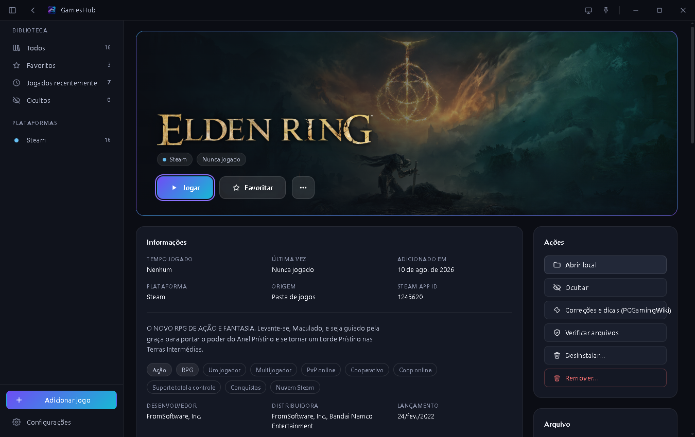
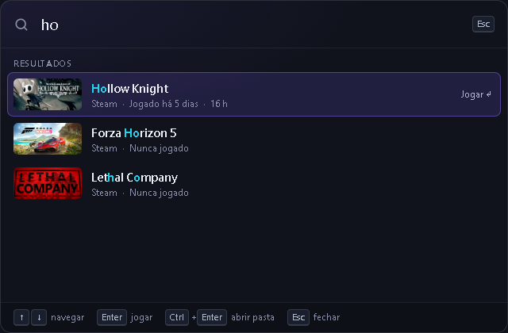
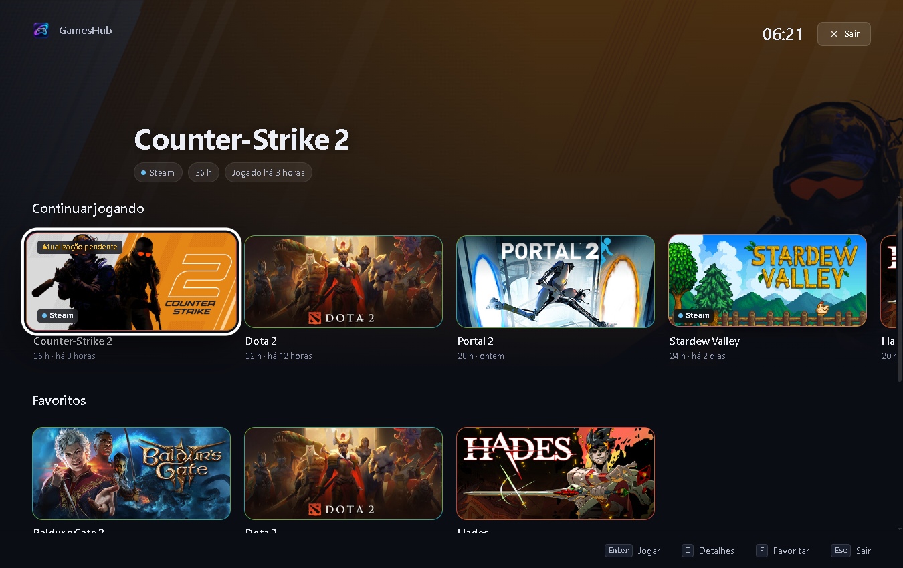

# GamesHub

[](https://github.com/brunocsilva41/GamesHub/actions/workflows/ci.yml)
[](https://github.com/brunocsilva41/GamesHub/actions/workflows/codeql.yml)
[](https://github.com/brunocsilva41/GamesHub/releases/latest)
[](https://github.com/brunocsilva41/GamesHub/releases)
[](LICENSE)
[](#requisitos)

**Uma biblioteca de jogos leve e bonita para Windows.** O GamesHub reúne num só lugar os jogos da Steam, da Epic
Games, da Riot, do Hydra e os atalhos da sua pasta de jogos, com artes em alta resolução, tempo de jogo, coleções,
informações de cada jogo e navegação por teclado ou controle. O executável tem menos de 1 MB, não exige conta, não
tem anúncios nem telemetria e não deixa nenhum serviço rodando em segundo plano.



| Detalhes do jogo | Busca rápida | Big Picture |
|---|---|---|
|  |  |  |

## Download

**[Baixe a versão mais recente](https://github.com/brunocsilva41/GamesHub/releases/latest)**: arquivo
`GamesHub-Setup-<versão>.exe`. Cada versão tem uma página com o resumo, a lista do que mudou (novidades,
melhorias, correções e segurança), capturas de tela, tamanho e SHA-256 do instalador, e o link para comparar
com a versão anterior — veja todas em [Releases](https://github.com/brunocsilva41/GamesHub/releases).

1. Execute o instalador e siga o assistente. A instalação é só para o seu usuário e não pede administrador.
2. Se o Windows SmartScreen avisar que o app não é reconhecido, é porque o instalador não tem assinatura de código
   paga. Confira o download (abaixo) e clique em **Mais informações → Executar assim mesmo**.
3. Quem já usava a versão 1.x ("GamesLounge") é atualizado no mesmo lugar, mantendo pasta de jogos, capas e
   histórico.

**Atualizações automáticas:** com o GamesHub instalado, novas versões chegam sozinhas — o app avisa quando há
uma atualização, baixa o instalador oficial desta página, confere o SHA-256 e atualiza mantendo suas
configurações, horas jogadas e artes. Dá para desligar em **Configurações → Atualizações**.

Para conferir o arquivo baixado (troque `<versão>` pelo número da versão):

```powershell
Get-FileHash .\GamesHub-Setup-<versão>.exe -Algorithm SHA256          # compare com o .sha256 da Release
gh attestation verify .\GamesHub-Setup-<versão>.exe --repo brunocsilva41/GamesHub
```

Detalhes em [docs/PIPELINE.md](docs/PIPELINE.md#como-verificar-um-download).

<details>
<summary>Instalação e remoção silenciosas (scripts)</summary>

```powershell
.\GamesHub-Setup-<versão>.exe /silent [/dir "C:\Apps\GamesHub"] [/games "D:\Jogos"] [/nodesktop] [/nostartmenu] [/autostart]
```

O resultado fica em `%TEMP%\GamesHub\setup-result.txt` (`OK:<pasta>` ou `ERRO:<mensagem>`) e o log em
`%TEMP%\GamesHub\setup.log`. Para remover: **Configurações do Windows → Aplicativos → GamesHub**, ou
`Uninstall.exe /silent` na pasta do programa (adicione `/purge` para apagar também seus dados).

</details>

## Recursos

- **Importação automática** dos jogos instalados na **Steam** (todas as bibliotecas), **Epic Games**, **Riot
  Games** e **Hydra Launcher**, além dos atalhos (`.lnk`, `.url`, `.exe`) da sua pasta de jogos. Jogos novos
  aparecem sozinhos; **F5** reescaneia na hora.
- **Adicionar jogos** arrastando um atalho ou executável para a janela, pelo seletor de arquivos (**Ctrl+N**) ou
  buscando na loja da Steam.
- **Artes em HD** (capa, cabeçalho, fundo, logotipo e ícone) baixadas automaticamente da Steam e do
  [SteamGridDB](https://www.steamgriddb.com/), inclusive para jogos fora da Steam, como os da Riot e o Roblox — sem
  nenhuma configuração. Qualquer arte pode ser trocada arrastando uma imagem.
- **Página de detalhes** com gêneros, descrição, desenvolvedora, data de lançamento e nota do Metacritic (da loja
  da Steam), tempo de jogo, tamanho em disco, aviso de atualização pendente, **Verificar arquivos** (Steam) e
  **Desinstalar** pela plataforma ou pelo desinstalador do Windows.
- **Saves e configurações** localizados pelo **PCGamingWiki**, com botão para abrir cada pasta, e link para as
  correções e dicas do jogo.
- **Variações de execução** (por exemplo, DirectX 11/12 ou com e sem mods) agrupadas num único card com
  **Jogar ▾**, com sugestões automáticas de agrupamento.
- **Ações antes e depois de jogar**, por jogo ou para todos: abrir ou fechar programas, trocar plano de energia,
  saída de áudio ou resolução da tela e aguardar. Tudo volta ao normal quando o jogo fecha.
- **Tempo de jogo** medido pelo GamesHub e **importado da Steam** (incluindo "jogado por último"), sem somar
  sessões em dobro.
- **Favoritos, coleções e jogos ocultos**; filtros por gênero, "Nunca jogados", "Sem jogar há 3+ meses" e
  "Instalados"; ordenação por nome, recentes, mais jogados, adicionados recentemente ou tamanho.
- **Atalhos quebrados** detectados e **limpeza da biblioteca** em um clique (os atalhos vão para uma lixeira
  interna, com desfazer).
- **Teclado e controle** (Xbox e compatíveis) em toda a interface e modo **Big Picture** para TV. O controle só
  age quando a janela do GamesHub está em foco, então não interfere no jogo.
- **Busca rápida**: uma paleta flutuante aberta de qualquer lugar do Windows com **Ctrl+Shift+Espaço**
  (personalizável) para abrir um jogo digitando parte do nome.
- **Atalho global** (**Ctrl+Alt+G**, personalizável) para mostrar o GamesHub, **bandeja do sistema** com jogos
  recentes, **Jump List** na barra de tarefas e início com o Windows.
- **Atualização automática**: o GamesHub avisa quando há versão nova nas Releases deste repositório e se atualiza
  com um clique, conferindo o SHA-256 do instalador.

O [Guia do usuário](docs/USER_GUIDE.md) explica cada recurso e todos os atalhos.

## Requisitos

- Windows 10 ou 11
- [Microsoft Edge WebView2 Runtime](https://go.microsoft.com/fwlink/p/?LinkId=2124703)
- .NET Framework 4.8

O WebView2 e o .NET Framework 4.8 já vêm no Windows 11 e nos Windows 10 atualizados. Se o WebView2 faltar, o
GamesHub avisa e oferece a página de download da Microsoft.

## Privacidade

O GamesHub não tem conta, telemetria, análise de uso nem anúncios, e todos os seus dados ficam no seu computador
(`%LOCALAPPDATA%\GamesHub`). Estas são as únicas conexões de rede que ele faz:

| Destino | Quando | Como desligar |
|---|---|---|
| CDN e loja da Steam (`steamstatic.com`, `store.steampowered.com`, `steamcommunity.com`) | Para baixar artes, identificar jogos fora da Steam pelo nome, buscar na tela "Adicionar" e obter gêneros e descrições (com cache de 30 dias) | Configurações → **Artes** → "Buscar artes automaticamente" e Configurações → **Fontes e dados** → "Buscar informações dos jogos" |
| SteamGridDB (`steamgriddb.com`) | Para baixar artes de jogos que a Steam não tem (usa a chave do GamesHub ou a sua, se você informar uma) | Configurações → **Artes** → "Buscar artes automaticamente" |
| PCGamingWiki (`pcgamingwiki.com`) e manifesto Ludusavi (`raw.githubusercontent.com`) | Quando você pede para localizar saves e configurações de um jogo | Configurações → **Fontes e dados** → "Consultar o PCGamingWiki" |
| GitHub (`api.github.com`, `github.com`) | Ao iniciar, para ver se há versão nova, e ao baixar uma atualização que você aceitou | Configurações → **Atualizações** → "Verificar atualizações ao iniciar" |

As requisições enviam apenas App IDs, nomes de jogos (nas buscas) e, no SteamGridDB, a chave de API.
Links que você abre (loja, PCGamingWiki, notas da versão) vão para o seu navegador. Detalhes técnicos em
[docs/ARCHITECTURE.md](docs/ARCHITECTURE.md#rede-e-privacidade).

## Onde ficam os dados

| O quê | Onde |
|---|---|
| Programa | `%LOCALAPPDATA%\Programs\GamesHub` |
| Configurações | `%LOCALAPPDATA%\GamesHub\settings.json` |
| Biblioteca (tempo de jogo, favoritos, coleções, edições) | `%LOCALAPPDATA%\GamesHub\library.json` |
| Cache de artes e informações | `%LOCALAPPDATA%\GamesHub\cache\` |
| Atalhos removidos (lixeira) | `%LOCALAPPDATA%\GamesHub\trash\` |
| Logs | `%LOCALAPPDATA%\GamesHub\logs\gameshub.log` |

O GamesHub nunca apaga arquivos de jogos: remover um jogo da pasta de jogos move o atalho para a lixeira do
próprio GamesHub, com opção de desfazer.

## Compilar a partir do código

Pré-requisitos: Windows 10/11, [.NET SDK 8](https://dotnet.microsoft.com/download) (usado apenas pelo compilador
Roslyn; o app roda no .NET Framework 4.8 do Windows e não usa pacotes NuGet) e, para as verificações da interface,
[Node.js](https://nodejs.org/) 20+.

```powershell
git clone https://github.com/brunocsilva41/GamesHub.git
cd GamesHub
./build.ps1                    # app em dist/app
./build.ps1 -Test              # + testes
./build.ps1 -Test -Package     # + instalador em dist/package (com .sha256)
./ci/Invoke-Pipeline.ps1       # a mesma pipeline da CI
```

Para desenvolver só a interface, abra `web/index.html` com qualquer servidor estático: sem o WebView2, ela usa uma
ponte simulada com dados de exemplo ("modo demonstração"). Para usar o app com uma biblioteca descartável, defina
a variável de ambiente `GAMESHUB_DATA_DIR` para outra pasta.

```
src/GamesHub/     app (C# WinForms + WebView2): Core, Library, Artwork, Integration, Integrations,
                  QuickLaunch, Update, Shared
src/Installer/    Setup.exe e Uninstall.exe
web/              interface (HTML/CSS/JS puro, sem frameworks, funciona offline)
tests/            testes
ci/               pipeline (local e CI)
docs/             documentação
```

Arquitetura, protocolo da ponte e modelo de segurança: [docs/ARCHITECTURE.md](docs/ARCHITECTURE.md).

## Pipeline de CI/CD

Cada push e pull request passa por higiene do repositório (segredos, codificação, binários fixados por SHA-256),
verificações da interface, build com avisos como erros, testes unitários, empacotamento, teste ponta a ponta num
Windows limpo (instalar, abrir, atualizar e desinstalar) e análise de segurança (CodeQL, gitleaks). As versões são
publicadas a partir de tags `vX.Y.Z`, com SHA-256 e atestação de proveniência. Veja
[docs/PIPELINE.md](docs/PIPELINE.md) e [docs/RELEASING.md](docs/RELEASING.md).

### Proteções do repositório

- **Revisão obrigatória:** todo pull request pede automaticamente a revisão do mantenedor (`CODEOWNERS`) e só
  pode ser integrado depois de aprovado; uma aprovação cai se o PR receber novos commits.
- **Checks obrigatórios:** pipeline completo, CodeQL (C# e JavaScript) e o **portão de segurança de PR**, todos
  verdes, com a branch atualizada e todas as conversas resolvidas.
- **Portão de segurança de PR:** analisa o diff de quem não é mantenedor em busca de mudanças em áreas sensíveis
  (workflows, pipeline, build, instalador, atualizador, binários) e de código de risco (execução de processos,
  download e execução, código dinâmico, registro do Windows, conteúdo ofuscado, novos endereços de rede,
  enfraquecimento da CSP/WebView2/TLS). Achados bloqueiam o PR até o mantenedor revisar cada item e aplicar a
  etiqueta `seguranca-aprovada`. Dependências vulneráveis também são barradas.
- **GitHub Actions:** workflows de colaboradores externos só rodam com aprovação do mantenedor, sem acesso a
  segredos e com token somente leitura; só Actions oficiais do GitHub, obrigatoriamente fixadas por SHA.
- **Segredos e dependências:** varredura de segredos com bloqueio no push, alertas e correções automáticas do
  Dependabot, e histórico da `main` protegido contra force-push e exclusão.

## Contribuindo

Contribuições são bem-vindas! Leia o [CONTRIBUTING.md](CONTRIBUTING.md) antes de abrir um pull request: rode
`./ci/Invoke-Pipeline.ps1` localmente, e saiba que todo PR passa pela revisão do mantenedor e pelos checks
descritos em [Proteções do repositório](#proteções-do-repositório). Dúvidas e ideias:
[Discussions](https://github.com/brunocsilva41/GamesHub/discussions). Para relatar um problema, use as
[issues](https://github.com/brunocsilva41/GamesHub/issues); para vulnerabilidades, siga o [SECURITY.md](SECURITY.md)
(relato privado). O histórico de versões está no [CHANGELOG.md](CHANGELOG.md).

## Licença

[MIT](LICENSE) © 2026 Bruno Silva.

O Microsoft Edge WebView2 é distribuído sob a licença da Microsoft (`lib/WebView2-LICENSE.txt`). GamesHub não é
afiliado à Valve, Epic Games, Riot Games, Hydra, SteamGridDB nem PCGamingWiki; os nomes e artes pertencem aos
seus respectivos donos.
