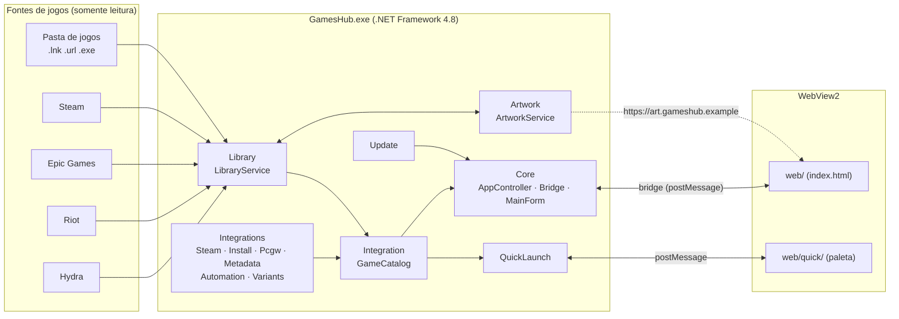
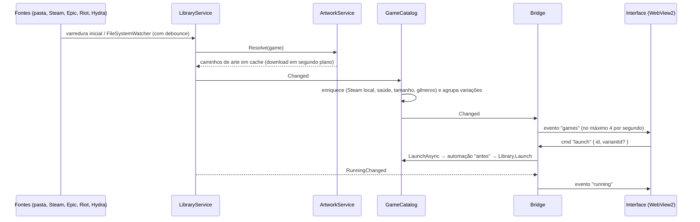

# Arquitetura do GamesHub

Este documento descreve como o GamesHub é organizado por dentro: tecnologias, módulos, fluxo de dados, o
protocolo entre a interface e o C#, o modelo de segurança e as conexões de rede. Ele é destinado a quem quer
entender, depurar ou contribuir com o código. Para o uso do app, veja o [Guia do usuário](USER_GUIDE.md); para o
processo de build e publicação, veja [PIPELINE.md](PIPELINE.md).

> O código é a fonte da verdade. Se algo aqui divergir do código, abra uma issue ou um PR corrigindo o documento.

## Sumário

- [Tecnologias e motivação](#tecnologias-e-motivação)
- [Visão geral](#visão-geral)
- [Mapa de módulos](#mapa-de-módulos)
- [Fluxo de dados](#fluxo-de-dados)
- [Onde ficam os dados](#onde-ficam-os-dados)
- [Protocolo da ponte (bridge)](#protocolo-da-ponte-bridge)
- [Modelo de segurança](#modelo-de-segurança)
- [Modelo de threads](#modelo-de-threads)
- [Rede e privacidade](#rede-e-privacidade)
- [Testes](#testes)

## Tecnologias e motivação

| Camada | Escolha | Por quê |
|---|---|---|
| Aplicativo | C# compilado pelo **Roslyn moderno** (do .NET SDK) contra o **.NET Framework 4.8** | O .NET Framework 4.8 já vem com o Windows 10/11: o executável tem poucas centenas de KB e não há runtime para distribuir. O Roslyn moderno permite sintaxe C# atual sem mudar o alvo. |
| Dependências | Nenhum pacote NuGet. Só assemblies do Framework e o **WebView2** (`lib/`) | Build reproduzível, superfície de ataque pequena, nada para atualizar além do WebView2. As DLLs de `lib/` têm SHA-256 fixado em `lib/checksums.sha256`. |
| Interface | **HTML/CSS/JS puro** com módulos ES, hospedado no **WebView2** | Interface moderna sem framework, sem etapa de build e sem CDN: funciona offline e é fácil de inspecionar. |
| Janela | WinForms sem moldura, desenhada pela própria interface (`app-region: drag`) | Visual consistente, cantos arredondados (DWM), DPI por monitor. |
| JSON | `JavaScriptSerializer` (`System.Web.Extensions`) | Disponível no Framework; evita dependências. |
| Instalador | `Setup.exe` próprio (C#), por usuário, sem administrador | Um único arquivo com o app embutido; sem MSI nem ferramentas de terceiros. |

Restrições que decorrem disso: as APIs usadas precisam existir no .NET Framework 4.8 (sem `System.Text.Json`,
`Span`, APIs do .NET 5+), e todo texto exibido ao usuário é em pt-BR. Código, comentários e logs são em inglês.

## Visão geral



Raiz de composição (`Core/Program.cs`):

```csharp
AppSettings settings = SettingsStore.Load();
var art     = new ArtworkService(settings);
var library = new LibraryService(settings, art);
var updater = new UpdateChecker(settings);
var catalog = new GameCatalog(settings, library, art);   // cria os serviços de integração
using (var app = new AppController(settings, art, library, catalog, updater, args, instance))
    Application.Run(app);
```

Todos os serviços recebem a **mesma instância viva** de `AppSettings`; `SettingsStore` a altera no lugar e emite
`Changed`. Os contratos compartilhados (tipos `Game`, `Artwork`, `OpResult`, `AppSettings` e as interfaces dos
serviços) ficam em `src/GamesHub/Shared/Contracts.cs` e `Contracts.Integrations.cs`.

## Mapa de módulos

```
src/GamesHub/
  Core/            processo, janela, WebView2, ponte, configurações, bandeja, integração com o Windows
  Library/         fontes (pasta, Steam, Epic), biblioteca persistida, execução, tempo de jogo
  Artwork/         download, cache e índice de artes; extração de ícones
  Integration/     GameCatalog: junta a biblioteca com as integrações
  Integrations/    Steam, Install, Pcgw, Metadata, Automation, Variants, Sources
  QuickLaunch/     paleta flutuante de busca rápida e seu atalho global
  Update/          verificação e instalação de atualizações (GitHub Releases)
  Shared/          contratos, caminhos, log, JSON, ambiente WebView2
  Properties/      AssemblyInfo.cs (fonte única da versão)
src/Installer/     Setup.exe e Uninstall.exe (Common/, Setup/, Uninstall/)
web/               interface principal (index.html, css/, js/) e web/quick/ (paleta)
tests/             testes C# (TestRunner próprio, sem frameworks)
```

**Core.** `Program` configura o processo (DPI por monitor v2, AppUserModelID, TLS 1.2), garante instância única
(mutex `Local\GamesHub.SingleInstance` + pipe nomeado para repassar a linha de comando à instância em execução) e
verifica se o WebView2 Runtime existe. `AppController` é o contexto da aplicação: cria a `MainForm`, a `Bridge`, a
bandeja (`TrayController`, com jogos recentes), a Jump List da barra de tarefas (`TaskbarJumpList`), o atalho global
(`GlobalHotkey`, via `RegisterHotKey`), o início com o Windows (chave `HKCU\...\Run`), a verificação de
atualização na inicialização e aplica os efeitos colaterais de cada mudança de configuração. `SettingsStore` valida
e persiste `settings.json` (patch parcial, chaves desconhecidas ignoradas, valores inválidos rejeitados).
Argumentos de linha de comando: `--minimized`, `--show`, `--debug` (habilita DevTools), `--quit`, `--launch <id>`.

**Library.** `LibraryService` monta a lista de jogos a partir da pasta de jogos (`FolderSource`: `.lnk`, `.url`,
`.exe`), da Steam (`SteamSource`: `libraryfolders.vdf` + `appmanifest_*.acf`), da Epic (`EpicSource`: manifestos
`.item`) e das fontes extras registradas pelo `GameCatalog`. `LibraryMerge` remove duplicatas, `LibraryStore`
persiste em `library.json` o que é do usuário (nome e argumentos editados, favoritos, ocultos, coleções, tempo de
jogo, data de adição). `GameLauncher` abre os jogos, `PlayTracker` mede o tempo de jogo observando processos pelo
executável/pasta de instalação (a cada 5 s) e `DebouncedWatcher` observa a pasta e as bibliotecas das lojas para
reescanear sozinho. Remover um jogo da pasta move o atalho para a lixeira interna, com desfazer; nada é apagado da
pasta de jogos sem ação explícita.

**Artwork.** `ArtworkService` resolve capa (`capsule`), cabeçalho (`header`), fundo (`hero`), logotipo (`logo`) e
ícone (`icon`) de cada jogo, em camadas: imagem personalizada do usuário → CDN da Steam (quando há App ID) →
SteamGridDB (somente com chave de API configurada) → ícone extraído do executável/atalho (`IconExtractor`). Jogos
sem App ID são associados a um App ID por busca aproximada na loja da Steam (`NameMatcher`), exceto os de
plataformas que não estão na Steam (Riot, Roblox…) e os marcados pelo usuário com App ID `0` ("não está na
Steam"), que vão direto ao SteamGridDB. Quando o SteamGridDB tem vários jogos com o mesmo nome exato, é escolhido o
lançamento mais recente. Downloads são limitados (3 simultâneos, 20 MB por arquivo), deduplicados por chave
(`KeyedTasks`) e pausados com recuo exponencial após falhas de rede (`HttpFetcher`). `ArtIndex` guarda associações
e resultados negativos para não repetir buscas. Também importa as capas da versão 1.x.

**Integration / GameCatalog.** Ponto único de leitura para a ponte, a bandeja e a busca rápida. Para cada jogo da
biblioteca, aplica: estatísticas locais da Steam (tempo de jogo — sempre o **maior** entre o do GamesHub e o da
Steam, nunca a soma —, jogado por último, atualização pendente, tamanho), saúde da instalação (atalho quebrado, com
cache de 60 s), tamanho em disco (calculado em segundo plano e cacheado), gêneros (do cache de metadados, com
pré-busca em segundo plano) e, por fim, o agrupamento de **variações**. `LaunchAsync` executa as ações "antes" da
automação, resolve a variação escolhida e abre o jogo; as ações "depois" rodam quando o processo termina.
`CleanupBroken` move para a lixeira todos os atalhos quebrados. `CatalogLibraryView` expõe o catálogo com a
interface `ILibraryService` para a busca rápida.

**Integrations/Steam.** Lê dados locais da Steam: tempo de jogo e última sessão (`userdata/<id>/config/localconfig.vdf`),
atualização pendente e tamanho (`appmanifest_*.acf`) e gera as URIs `steam://validate/<id>` e
`steam://uninstall/<id>`.

**Integrations/Install.** Detecta atalhos quebrados (destino inexistente), calcula tamanhos de pasta (cache em
`cache/install/sizes.json`), lista unidades e espaço livre e encontra o desinstalador de cada jogo (Steam, Epic ou
a entrada do registro de "Programas e Recursos").

**Integrations/Pcgw.** Consulta o PCGamingWiki para obter o link da página do jogo e os locais de **saves** e
**configurações**, expandindo as variáveis do wiki (`{{p|appdata}}`, etc.) em caminhos reais e verificando se
existem. Respeita limite de taxa e detecta o desafio anti-bot do site; nesse caso usa o manifesto do
[Ludusavi](https://github.com/mtkennerly/ludusavi-manifest) (gerado a partir do PCGamingWiki) como alternativa.
Resultados ficam em `cache/pcgw/`.

**Integrations/Metadata.** Busca gêneros, categorias, descrição curta, data de lançamento, desenvolvedoras,
publicadoras e nota do Metacritic na API pública da loja da Steam (`appdetails`, em pt-BR), com limite de taxa e
cache de 30 dias em `cache/meta/<appid>.json`.

**Integrations/Automation.** Perfis de ações "antes de jogar" e "depois de jogar", por jogo e um perfil padrão
global: abrir programa (`run`), fechar programa (`close`), plano de energia (`powerPlan`), saída de áudio
(`audioDevice`), resolução da tela (`resolution`) e aguardar (`wait`, até 30 s). O que foi alterado é restaurado
quando o jogo fecha; o estado pendente fica em `automation-state.json`, de modo que um encerramento inesperado é
corrigido na próxima inicialização (`RecoverAutomation`).

**Integrations/Variants.** Agrupa várias entradas do mesmo jogo (por exemplo, "DirectX 11" e "DirectX 12", com e
sem mods) em um único card com uma versão principal. Sugere grupos por semelhança de nome
(`VariantSuggester`), que o usuário aceita ou dispensa. Persistido em `variants.json`.

**Integrations/Sources.** Fontes extras: **Riot** (lê `RiotClientInstalls.json` e os metadados em
`C:\ProgramData\Riot Games`; abre pelo Riot Client) e **Hydra** (lê o banco LevelDB do Hydra 3.x em
`%APPDATA%\hydralauncher\hydra-db` com um leitor LevelDB/Snappy próprio, somente leitura).

**QuickLaunch.** Paleta flutuante (`QuickLaunchForm`, uma segunda WebView2 com a página `web/quick/`) aberta por um
atalho global configurável (padrão `Ctrl+Shift+Space`), que funciona mesmo com o GamesHub na bandeja. A busca e a
ordenação são feitas em C# (`QuickSearch`); a página só exibe resultados. Usa um protocolo de mensagens próprio,
mais simples que a ponte principal, e aceita mensagens apenas da origem `https://app.gameshub.example/quick/`.

**Update.** `UpdateChecker` consulta `https://api.github.com/repos/<dono>/<repo>/releases/latest` (padrão
`brunocsilva41/GamesHub`), compara versões SemVer, baixa o `GamesHub-Setup-<versão>.exe` para `%TEMP%\GamesHub`,
confere o `.sha256` publicado junto e executa o instalador com `/update`; o app então se encerra para que os
arquivos sejam substituídos, e o instalador o reabre.

**Installer.** `Setup.exe` contém o app inteiro como recurso (`payload.zip`). Instala por usuário em
`%LOCALAPPDATA%\Programs\GamesHub` sem pedir administrador, cria atalhos, registra a entrada de desinstalação em
`HKCU` e atualiza a 1.x no mesmo lugar. Modos: assistente, `/silent` (com `/dir`, `/games`, `/nodesktop`,
`/nostartmenu`, `/autostart`) e `/update`. `Uninstall.exe` remove app, atalhos (inclusive os fixados na barra de
tarefas e a entrada de início com o Windows) e, se o usuário pedir (`/purge` no modo silencioso), os dados em
`%LOCALAPPDATA%\GamesHub`. Resultados e logs ficam em `%TEMP%\GamesHub\`.

## Fluxo de dados



1. As fontes são lidas na inicialização e reavaliadas quando a pasta de jogos ou as bibliotecas das lojas mudam
   (ou com **F5**).
2. `LibraryService` mescla as fontes com `library.json` e pede as artes ao `ArtworkService`; quando uma arte chega,
   o jogo é atualizado e `Changed` é emitido (com agrupamento de 300 ms).
3. `GameCatalog` produz a lista enriquecida e com variações agrupadas, que é a mesma para a interface, a bandeja, a
   Jump List e a busca rápida.
4. A `Bridge` serializa os jogos como `GameDto` e envia o evento `games` (coalescido a no máximo 4/s). As artes são
   servidas pelo host virtual `art.gameshub.example` com `?v=<data de modificação>` para invalidar o cache do
   navegador.

## Onde ficam os dados

Tudo o que é do usuário fica em `%LOCALAPPDATA%\GamesHub` (`AppPaths.DataDir`). Nada é gravado ao lado do
executável nem dentro da pasta de jogos, exceto os atalhos que o usuário adiciona explicitamente.

| O quê | Onde |
|---|---|
| Programa | `%LOCALAPPDATA%\Programs\GamesHub\` (instalador) |
| Configurações | `%LOCALAPPDATA%\GamesHub\settings.json` |
| Biblioteca (edições, favoritos, ocultos, coleções, tempo de jogo, datas) | `%LOCALAPPDATA%\GamesHub\library.json` |
| Automação (perfis / estado pendente) | `automation.json`, `automation-state.json` |
| Variações | `variants.json` |
| Janela (tamanho, posição, maximizada) | `window.json` |
| Cache de artes | `cache\art\` (com `index.json`) |
| Cache de metadados, PCGamingWiki e tamanhos | `cache\meta\`, `cache\pcgw\`, `cache\install\` |
| Atalhos removidos (lixeira com desfazer) | `trash\` |
| Logs (1 MB por arquivo, 3 rotações) | `logs\gameshub.log` |
| Perfil do WebView2 | `webview\` |
| Logs e resultado do instalador | `%TEMP%\GamesHub\setup.log`, `uninstall.log`, `setup-result.txt` |
| Dados da 1.x (migração única, somente leitura) | `<pasta de jogos>\_hub\` |

A variável de ambiente **`GAMESHUB_DATA_DIR`** substitui `%LOCALAPPDATA%\GamesHub` por outra pasta. O executor de
testes a usa para nunca tocar nos dados reais, e ela é útil para depurar com uma biblioteca descartável.

## Protocolo da ponte (bridge)

A interface e o C# conversam apenas por mensagens JSON do WebView2: `chrome.webview.postMessage(obj)` (JS → C#) e
`CoreWebView2.PostWebMessageAsJson(json)` (C# → JS). Não há servidor HTTP local nem portas abertas. O lado C# fica
em `Core/Bridge.cs`, `Core/BridgeCommands.cs`, `Core/BridgeCommands.Integrations.cs` e `Core/BridgeDto.cs`; o lado
JS em `web/js/bridge.js`.

### Requisição e resposta

```json
{ "type": "cmd", "id": 17, "name": "launch", "args": { "id": "steam:730" } }
```

O C# responde **exatamente uma vez** a cada requisição:

```json
{ "type": "reply", "id": 17, "ok": true,  "data": { } }
{ "type": "reply", "id": 17, "ok": false, "error": "Mensagem em pt-BR" }
```

Quando o comando devolve um `OpResult`, `data` é `{ message, undoToken, gameId }` e `ok` espelha o resultado
(`error` = `message` em caso de falha). Mensagens de origem diferente de `https://app.gameshub.example` são
ignoradas. Erros inesperados são registrados no log e respondidos com uma mensagem genérica. O lado JS aplica um
tempo limite por comando (15 s por padrão, sem limite para diálogos nativos).

### Eventos (C# → JS)

```json
{ "type": "event", "name": "<nome>", "data": { } }
```

| Evento | `data` | Quando |
|---|---|---|
| `games` | `{ games: GameDto[], collections: string[] }` | a lista mudou (coalescido, ≤ 4/s) |
| `running` | `{ id, running }` | um jogo abriu ou fechou |
| `settings` | `SettingsDto` | depois de uma mudança de configuração |
| `toast` | `{ text, kind: "ok"\|"err"\|"info", undoToken? }` | avisos originados no C# |
| `update` | `{ version, notes, pageUrl }` | atualização encontrada na verificação da inicialização |
| `updateProgress` | `{ percent }` | durante o download da atualização |
| `navigate` | `{ view: "library"\|"settings"\|"game", id? }` | ações da bandeja, Jump List ou atalho |
| `focusSearch` | `{}` | atalho global pressionado com a janela visível |
| `windowState` | `{ maximized, fullscreen, pinned }` | o estado da janela mudou |

### Comandos (JS → C#)

**Estado, biblioteca e janela**

| Comando | `args` | `data` da resposta |
|---|---|---|
| `getState` | — | `{ games, collections, settings, version, windowState, demo: false }` |
| `launch` | `{ id, variantId? }` | `OpResult` (executa a automação "antes"; depois aplica `onLaunch`) |
| `reveal` | `{ id }` | `OpResult` (abre o Explorador no local do jogo) |
| `remove` | `{ id }` | `OpResult` com `undoToken` |
| `undo` | `{ token }` | `OpResult` |
| `updateGame` | `{ id, edit: { name?, launchArgs?, steamAppId?, favorite?, hidden?, collections? } }` | `OpResult` |
| `addFiles` | `{}` + arquivos soltos via `postMessageWithAdditionalObjects` (`.exe`, `.lnk`, `.url`) | `{ results: OpResult[] }` (cada item com `ok`) |
| `pickFile` | — | `OpResult` ou `{ cancelled: true }` |
| `addSteam` | `{ appId, name? }` | `OpResult` |
| `searchSteam` | `{ query }` | `{ results: [{ appId, name, iconUrl }] }` |
| `rescan` | — | `OpResult` |
| `cleanupBroken` | — | `{ results: OpResult[] }` |
| `window` | `{ action: "minimize"\|"maximize"\|"restore"\|"close"\|"pin"\|"fullscreen", on? }` | `windowState` |
| `quit` | — | `{}` (encerra de verdade, ignorando "fechar para a bandeja") |

**Artes**

| Comando | `args` | `data` da resposta |
|---|---|---|
| `setArt` | `{ id, kind }` + opcionalmente uma imagem solta; sem arquivo abre o seletor nativo | `OpResult` ou `{ cancelled: true }` |
| `clearArt` | `{ id, kind }` | `OpResult` |
| `refreshArt` | `{ id }` | `OpResult` |

`kind` ∈ `header`, `capsule`, `hero`, `logo`, `icon`.

**Detalhes do jogo e integrações**

| Comando | `args` | `data` da resposta |
|---|---|---|
| `getGameInfo` | `{ id }` | `{ appId, info: GameInfo\|null, steam: SteamLocalStats\|null, health: { broken, reason }, uninstall: { method, displayName }, canValidate, sizeBytes, pcgwUrl }` |
| `getPcgw` | `{ id }` | `PcgwInfo` (`found, pageUrl, title, saveLocations[], configLocations[]`) |
| `openPath` | `{ path }` | `OpResult` (somente caminhos devolvidos antes por `getPcgw`) |
| `validateGame` | `{ id }` | `OpResult` (abre `steam://validate/<id>`) |
| `uninstallGame` | `{ id }` | `OpResult` (Steam, Epic ou desinstalador do registro) |
| `getDrives` | — | `{ drives: [{ name, label, totalBytes, freeBytes }] }` |
| `getGenres` | — | `{ genres: string[] }` |

**Automação**

| Comando | `args` | `data` da resposta |
|---|---|---|
| `getAutomation` | `{ id }` (vazio = perfil padrão) | `AutomationProfile` |
| `saveAutomation` | `{ id, profile }` (vazio = perfil padrão) | `OpResult` |
| `automationOptions` | — | `{ powerPlans, audioDevices, resolutions }` (listas de `{ id, name, current }`) |

**Variações**

| Comando | `args` | `data` da resposta |
|---|---|---|
| `variantGroups` | — | `{ groups: VariantGroup[] }` |
| `variantSuggestions` | — | `{ groups: VariantGroup[] }` |
| `groupVariants` | `{ ids: string[], primaryId }` | `OpResult` |
| `ungroupVariants` | `{ groupId }` | `OpResult` |
| `setVariantLabel` | `{ id, label }` | `OpResult` |
| `setVariantPrimary` | `{ groupId, primaryId }` | `OpResult` |
| `dismissVariants` | `{ ids: string[] }` | `OpResult` |

**Configurações, atualizações e diversos**

| Comando | `args` | `data` da resposta |
|---|---|---|
| `setSettings` | `{ patch: Partial<SettingsDto> }` | `SettingsDto` (aplica efeitos: início com o Windows, atalhos, reescaneamento) |
| `pickGamesDir` | — | `SettingsDto` ou `{ cancelled: true }` |
| `openExternal` | `{ url }` | `{}` (somente `https:`) |
| `openDataFolder` | `{ sub?: "logs" }` | `{}` |
| `checkUpdate` | — | `{ available, version, notes, pageUrl }` |
| `installUpdate` | — | `{ started }` |
| `log` | `{ level: "info"\|"warn"\|"error", msg }` | `{}` |

Comandos desconhecidos respondem `ok: false` com "Comando desconhecido".

### Formatos (JSON em camelCase)

```ts
GameDto = {
  id, name, platform, source, ext, filePath, installDir, launchArgs, steamAppId,
  favorite: boolean, hidden: boolean, collections: string[],
  lastPlayed: string | null,      // ISO 8601 UTC
  playSeconds: number, addedAt: string, running: boolean,
  sizeBytes: number,              // -1 = desconhecido
  updatePending: boolean, broken: boolean, brokenReason: string,
  genres: string[],
  variants: { id, label }[],      // outras versões agrupadas neste card
  art: { header, capsule, hero, logo, icon }  // "https://art.gameshub.example/<rel>?v=<ticks>" ou null
}

SettingsDto = {
  gamesDir, importSteam, importEpic, importRiot, importHydra,
  onLaunch: "tray" | "minimize" | "none",
  startWithWindows, startMinimized, closeToTray,
  hotkeyEnabled, hotkey,                       // ex.: "Ctrl+Alt+G"
  quickLaunchEnabled, quickLaunchHotkey,       // ex.: "Ctrl+Shift+Space"
  sortBy: "name" | "recent" | "playtime" | "added",
  view: "grid" | "list", cardStyle: "landscape" | "portrait",
  reduceMotion, autoArtwork, steamGridDbKey, trackPlaytime,
  importSteamPlaytime, fetchMetadata, pcgwEnabled, automationEnabled,
  checkUpdates, updateRepo,                    // "dono/repositório"
  language: "pt-BR"
}

AutomationProfile = { enabled, useDefault, before: AutomationAction[], after: AutomationAction[] }
AutomationAction  = { type: "run"|"close"|"powerPlan"|"audioDevice"|"resolution"|"wait",
                      target, args, seconds, enabled }
VariantGroup      = { id, primaryId, memberIds: string[], labels: { [memberId]: string } }
```

`SettingsDto` é gerado a partir dos campos públicos de `AppSettings`; um campo novo em `AppSettings` aparece
automaticamente no DTO e é validado por tipo em `SettingsStore`.

### Modo demonstração

Sem `window.chrome.webview` (a página aberta direto num navegador), a interface usa uma ponte simulada
(`web/js/mock.js`, `mock-data.js`, `mock-features.js`, `mock-variants.js`) com dados de exemplo e mostra o selo
"modo demonstração". Isso permite desenvolver e tirar capturas de tela da interface sem o app. A simulação nunca é
usada dentro do app. Todo comando novo precisa existir nos três lugares: C#, interface e simulação (a pipeline
verifica isso, veja [PIPELINE.md](PIPELINE.md)).

## Modelo de segurança

O GamesHub roda com os privilégios do usuário, sem administrador, e trata a página como não confiável.

- **Hosts virtuais.** A interface é servida de `https://app.gameshub.example/` (mapeado para a pasta `web/`) e as
  artes de `https://art.gameshub.example/` (mapeado para `cache\art\`). O domínio `.example` é reservado e nunca
  resolve na internet.
- **Origem verificada.** A ponte só aceita mensagens cuja origem seja o host do app (https, porta padrão); a paleta
  só aceita a origem `.../quick/`.
- **Navegação filtrada.** Qualquer navegação para fora do host do app é cancelada. Links `https:` clicados pelo
  usuário abrem no navegador padrão; iframes externos, pop-ups, downloads, esquemas externos (`steam:`, `ms-…:`
  etc.) e pedidos de permissão (câmera, microfone, notificações…) são bloqueados e registrados no log.
- **`openExternal` só aceita `https:`** sem credenciais embutidas na URL.
- **`openPath` usa lista de permissões:** só abre pastas que o próprio C# devolveu antes em `getPcgw` e que
  existem; qualquer outro caminho é recusado.
- **Artes** só são servidas por caminhos relativos normalizados (sem `..`, `:` ou segmentos vazios).
- **WebView2 travado em produção:** sem DevTools, menu de contexto do navegador, atalhos do navegador, zoom,
  autopreenchimento, salvamento de senhas nem objetos de host. `--debug` libera as ferramentas de desenvolvedor.
- **Entradas validadas no C#:** App IDs só com dígitos, tipos de arte de uma lista fixa, configurações com
  validação por chave (pasta existente, atalho válido, `dono/repositório`, chave do SteamGridDB alfanumérica,
  valores de enumeração).
- **Atualizações:** só URLs `https:` do GitHub; o instalador baixado é conferido com o `.sha256` publicado.
- **Escritas atômicas:** arquivos JSON são gravados em arquivo temporário e substituídos, então uma queda nunca
  deixa um arquivo pela metade.

Para relatar vulnerabilidades, veja [SECURITY.md](../SECURITY.md).

## Modelo de threads

- **Thread de interface (STA, WinForms).** Janela, WebView2, bandeja, atalhos globais e toda chamada ao
  `CoreWebView2` acontecem nela. Qualquer outro código volta para ela com `AppController.RunOnUi`.
- **Comandos da ponte** começam na thread de interface; trabalho de disco ou rede vai para o pool com `Task.Run`, e
  a resposta é postada de volta na thread de interface. `Bridge.Emit` pode ser chamado de qualquer thread.
- **Eventos coalescidos.** `EventCoalescer` limita o evento `games` a 4/s e a Jump List a uma atualização a cada 2 s.
  A biblioteca agrupa mudanças (300 ms) e os observadores de arquivos têm debounce (700 ms para a pasta de jogos,
  2 s para as lojas).
- **Serviços em segundo plano.** Artes (até 3 downloads simultâneos, deduplicados por chave), pré-busca de
  metadados (com limite de taxa), cálculo de tamanho (uma tentativa por sessão) e o `PlayTracker` (varredura de
  processos a cada 5 s) rodam fora da thread de interface.
- **Dados compartilhados** usam coleções concorrentes ou `lock`; `AppSettings` é uma instância única lida pelos
  serviços e alterada apenas por `SettingsStore`.
- **Erros** nunca são engolidos em silêncio: no mínimo `Log.Warn`. Exceções não tratadas na interface mostram um
  aviso sem derrubar o app (no máximo um a cada 30 s).

## Rede e privacidade

O GamesHub não tem conta, telemetria, análise de uso nem anúncios. Estas são **todas** as conexões que ele faz, e
quando:

| Destino | Para quê | Quando | Como desligar |
|---|---|---|---|
| `shared.cloudflare.steamstatic.com`, `cdn.cloudflare.steamstatic.com` | Baixar artes da Steam | Jogos sem arte em cache | Configurações → Artes → "Buscar artes automaticamente" |
| `store.steampowered.com/api/storesearch`, `steamcommunity.com/actions/SearchApps` | Associar jogos fora da Steam a um App ID; busca na tela "Adicionar" | Jogos sem App ID; quando você busca | Informe o App ID (ou `0`) / desligue as artes automáticas |
| `store.steampowered.com/api/appdetails` | Gêneros, descrição, lançamento, Metacritic; nome ao adicionar pela Steam | Em segundo plano (cache de 30 dias) e ao abrir os detalhes | Configurações → Fontes e dados → "Buscar informações dos jogos" |
| `www.steamgriddb.com/api/v2` | Artes alternativas | Somente se você informar sua chave de API | Apague a chave |
| `www.pcgamingwiki.com` | Locais de saves/configurações | Quando você clica em **Localizar** em "Saves e configurações" (o link "Correções e dicas" só abre o navegador) | Configurações → Fontes e dados → "Consultar o PCGamingWiki" |
| `raw.githubusercontent.com` (manifesto Ludusavi) | Alternativa quando o PCGamingWiki bloqueia a consulta (cerca de 2,4 MB, renovado a cada 14 dias) | Idem | Idem |
| `api.github.com`, `github.com` | Verificar e baixar atualizações do repositório configurado (padrão `brunocsilva41/GamesHub`) | Ao iniciar (se ligado), em "Verificar agora" e ao aceitar uma atualização | Configurações → Atualizações → "Verificar atualizações ao iniciar" |

As requisições são HTTPS, identificam-se com o User-Agent `GamesHub/<versão>` e não enviam dados pessoais:
apenas App IDs, nomes de jogos (nas buscas) e, no SteamGridDB, a chave que você forneceu. Links que você abre
(loja, PCGamingWiki, página da versão) vão para o seu navegador. O Microsoft Edge WebView2 Runtime é um componente
do Windows e é atualizado pelo próprio Windows, fora do controle do GamesHub.

## Testes

- **C#:** `tests/**` com um executor próprio (`tests/TestRunner.cs`: toda classe estática pública terminada em
  `Tests` e todo método `Test*` sem parâmetros). O executor define `GAMESHUB_DATA_DIR` para uma pasta temporária,
  aceita `--filter <texto>` e `--junit <arquivo>`. Os testes cobrem parsers (VDF, manifestos, LevelDB, wikitext),
  regras da biblioteca, associação de nomes, DTOs da ponte, validação de configurações, atalhos e atualizações.
- **Web:** verificações estáticas e testes com `node --test` (veja [PIPELINE.md](PIPELINE.md)).
- **Ponta a ponta:** instalação silenciosa, inicialização e inspeção do app, atualização e desinstalação num
  Windows limpo, executados na integração contínua.
